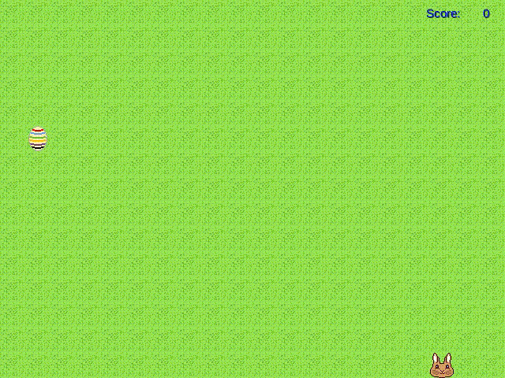

# Games, Games, Games :video_game: :tv:

Hi people,

I will release here my developed just 4 fun games. Planned is to release ever 2-4 weeks a new simple funny game or new updates.

To play the Java-Games you have to install the <a href="https://www.java.com/de/download/manual.jsp">Java-Runtime-Environment</a> for your appropriate operating system (Windows, Linux, MacOS) and download and execute the starter file ```<game_name>.bat``` (batch-file) and Java-Game-File ```<game_name>.jar``` (java archive)  which is included also in the games download directory!

Have fun and enjoy them!

And now in the sense of the ancient romans:

"Let the games begin..." :video_game:

"Ave imperator, morituri :skull: te salutant!" :thumbsdown: :hand: :thumbsup:

<table>
<thead>
  <tr>
    <th>Preview</th>
    <th>Game Name</th>
    <th>Description</th>
    <th>Version</th>
    <th>Release Date</th>
  </tr>
</thead>
<tbody>
  <tr>
    <td>
    <td><a href="Easter_Snake/"/>Easter Snake Game</a></td>
    <td>Funny snake game with the easter rabbit "Django" :rabbit: on the search for his eggs :egg:.</td>
    <td align=center>Desktop<br />1.0</td>
    <td>2023-04-08</td>
  </tr>
  <tr>
    <td>
    <td><a href="Easter_Snake/"/>Easter Snake Game</a></td>
    <td>"Django" :rabbit: gets egg :egg: power :muscle: and becomes faster and more points after finding 10 eggs each time. Also he gots his own Speed gauge. Yeahhh</td>
    <td align=center>Desktop<br />1.1</td>
    <td>2023-04-09</td>
  </tr>
  <tr>
    <td>
    <td><a href="Flappee_Android/"/>Flappee</a></td>
    <td>Simple Flappy clone demo for Android, collision detection not yet implemented, no GUI</td>
    <td align=center>Android<br />0.1</td>
    <td>2023-04-13</td>
  </tr>

</tbody>
</table>
